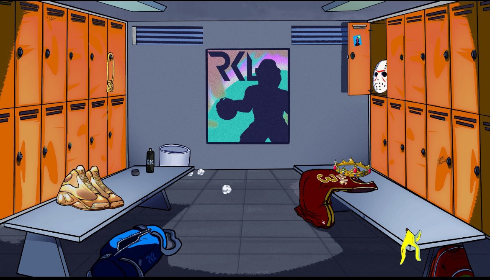

# NFT Marketplace

Contracts herein define a minimal general trustless marketplace for any ERC-721 or ERC-1155 implementation. They support:

- batch trading
- royalties
- withdraw pattern to avoid re-entrancy issues
- modular, you can decide if you would like to include royalties or not, for example
- events for optimal subgraph indexing
- on-chain permit signatures to facilitate superior NFT transfer UX (only contract can execute)
- (potentially) order editing

They are well-tested, a combination of stateful and unit tests.

You can use poetry for easy python virtual environment and requirements handling.

---

LFG 👑🦍
